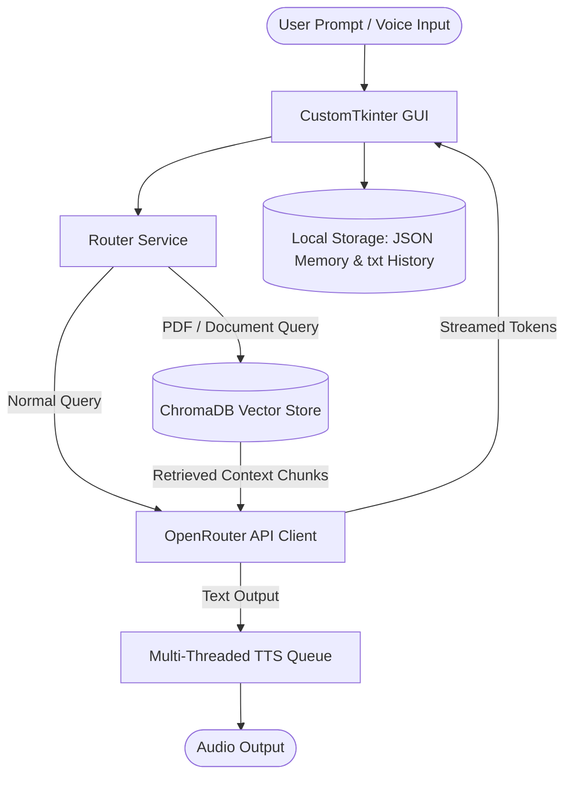

# MemoMind AI

MemoMind AI is a production-ready, feature-rich Python desktop application that integrates Generative AI, Retrieval-Augmented Generation (RAG), local vector databases, multi-threaded text-to-speech (TTS), speech recognition, and persistent conversation memory. Built with a modern CustomTkinter user interface, the application is designed to act as a personal document intelligence assistant and Python tutor.

---

## Architecture Overview

MemoMind AI utilizes a modular service-oriented architecture to isolate specific capabilities (e.g., user routing, vector store queries, voice playback) from the user interface.

### System Workflow Diagram


---

## Folder Structure

Below is the directory layout of the application showing its core modules and databases:

```text
pythonProject/
│
├── memo_mind_open_router_api.py  # Main monolithic application entrypoint (CustomTkinter GUI)
│
├── services/
│   └── router_service.py         # Query routing logic (Normal Chat, PDF Question, PDF Summary)
│
├── testfunc.py                   # Experimental/standalone DuckDuckGo web search capability
│
├── chats/                        # Cached and saved conversation files
├── pdf/                          # Uploaded and parsed PDF source files
├── chroma_db/                    # Local ChromaDB persistent vector database
│
├── memory.json                   # Serialized conversation state (messages list payload)
├── chat_history.txt              # Plain-text transcripts log
└── README.md                     # Project documentation
```

---

## Core Modules & Functionality

### 1. Generative AI Integration (OpenRouter)
* **OpenRouter Client:** Connects to OpenRouter's API endpoint using the `openai` SDK library wrapper.
* **Model Routing:** Targets `google/gemma-4-31b-it:free` with temperature parameter tuning (`0.3`) and fallback redundancy mechanisms to prevent service interruption.
* **Streaming Responses:** Implements token-by-token text insertion in the GUI in real-time, providing immediate visual feedback to the user.

### 2. Retrieval-Augmented Generation (RAG) & Vector Database
* **Local Embeddings:** Employs the `SentenceTransformer` framework (`all-MiniLM-L6-v2` model) to compute 384-dimensional dense vector embeddings of document chunks and search queries.
* **ChromaDB Integration:** Instantiates a `PersistentClient` pointing to local storage. Text passages are indexed dynamically into the `multi_pdf_collection` collection.
* **Context Retrieval:** Queries the vector database for top-$k$ ($k=5$) relevant chunks using cosine similarity/L2 metrics, passing matching chunks as context inside generative prompts.

### 3. Document Processing (PDF QA & Summarization)
* **Dynamic Upload:** Allows users to select files via standard OS file dialogs, moving them to a target `pdf/` subdirectory.
* **Chunking Pipeline:** Extracts text from PDF pages page-by-page using `pypdf.PdfReader`, slices it into overlapping chunks of 500 characters, calculates the vector embedding for each, and uploads the payload along with metadata (source document name, page number) to ChromaDB.
* **PDF QA Mode:** Retrieves specific content matching the user's questions and outputs sources and citations in the chat box window.
* **PDF Summary Mode:** Aggregates up to the first 50 chunks of the uploaded document to form an extensive hierarchical prompt summarizing core structures, executive points, key topics, and conclusions.

### 4. Voice AI (Speech-to-Text & Text-to-Speech)
* **Speech-to-Text (STT):** Uses the `speech_recognition` module utilizing the Google Speech API to listen, adjust for ambient background noise, and write transcribed text directly to the user entry bar.
* **Multi-Threaded Text-to-Speech (TTS):** Uses the `pyttsx3` offline engine. Spoken output is run inside a separate background thread (`speech_worker`) feeding from a thread-safe `queue.Queue`. This prevents blockages or lag in UI rendering. Users can instantly halt speech at any time using a dedicated `Stop Speaking` button.

### 5. Memory & Chat History Storage
* **Session Memory (`memory.json`):** Retains system prompts and the most recent 100 interaction payloads. The session is automatically reloaded at startup.
* **Plain Text Transcripts (`chat_history.txt`):** Writes continuous plain-text logs for audit trails and readable chat review.
* **Clean Actions:** Features options to wipe session memory or completely clear screen logs.

### 6. Web Search Functionality (Experimental)
* Located in `testfunc.py`, the module provides DuckDuckGo web search integration using the `duckduckgo_search` library. It detects queries containing time-based indicators (e.g. *today, latest, news, current*) and pulls live online snippets.

---

## Installation & Setup

### Prerequisites
* Python 3.10+
* Virtual Environment setup (`venv`)

### Installation Steps

1. **Clone the Repository:**
   ```bash
   git clone <repository_url>
   cd pythonProject
   ```

2. **Set up Virtual Environment:**
   ```bash
   python -m venv .venv
   .venv\Scripts\activate   # Windows
   source .venv/bin/activate # macOS/Linux
   ```

3. **Install Dependencies:**
   ```bash
   pip install customtkinter openai speechrecognition pyttsx3 pypdf sentence-transformers chromadb duckduckgo-search
   ```

4. **Run the Application:**
   ```bash
   python memo_mind_open_router_api.py
   ```
